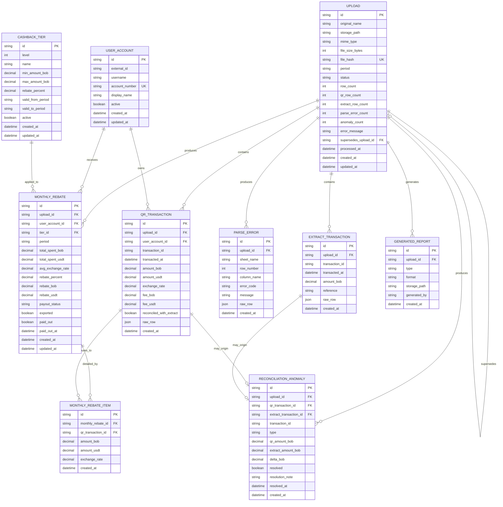

# BanexReintegra - Primera propuesta de base de datos

Esta propuesta toma como fuente principal `FLOW.md` y sus anexos `design.md` y `agents.md`.
La idea es partir de un modelo que soporte bien:

- carga e idempotencia de archivos
- procesamiento asíncrono por upload
- persistencia auditable de transacciones, reintegros y anomalías
- versionado de tiers por período
- generación posterior de reportes sin recalcular

No es un contrato final. Es una base razonable para analizar antes de bajar a Prisma.

## Criterios de diseño

- El `Upload` es la unidad operativa principal.
- Las transacciones QR y las del extracto se guardan por separado para conservar trazabilidad completa.
- El reintegro mensual se persiste agregado por cuenta/usuario, pero mantiene relación con sus transacciones fuente.
- Los tiers se versionan por vigencia, no se pisan.
- Las anomalías y errores de parseo quedan auditables por upload.

## Diagrama ER en Mermaid

## Lectura del modelo

### 1. `Upload`

Es el centro del proceso. Representa el archivo recibido, su hash, su estado y los conteos finales del procesamiento.

Campos importantes:

- `file_hash` para idempotencia
- `status` para `PENDING | PROCESSING | DONE | FAILED | SUPERSEDED`
- `supersedes_upload_id` para el caso de reemplazo de período
- `processed_at` para auditoría operativa

### 2. `UserAccount`

Agrupa al beneficiario desde la óptica operativa. El identificador más confiable parece ser `account_number`, mientras `username` o `external_id` pueden cambiar o venir incompletos.

### 3. `QRTransaction`

Guarda cada fila válida de `Pago QR`. Es la fuente del cálculo de reintegros.

Sugerencia de constraint:

- unique compuesto en `upload_id + transaction_id`

Si después confirmamos que `transaction_id` es globalmente único, podríamos endurecerlo más.

### 4. `ExtractTransaction`

Conviene separarla de `QRTransaction` porque su semántica es distinta: no participa en tiers, solo en conciliación. Esto simplifica trazabilidad y evita meter columnas nulas en una tabla única de transacciones.

### 5. `ParseError`

Responde directo al flujo y a `PersistenceAgent`: guardar filas problemáticas sin abortar todo el job.

Útil para:

- mostrar errores por hoja/fila
- exportarlos luego en reportes
- reentrenar reglas de parsing más adelante

### 6. `ReconciliationAnomaly`

Representa la salida del `ReconcileAgent`.

Tipos esperados:

- `NO_EXTRACT`
- `NO_QR`
- `AMOUNT_MISMATCH`
- posible extensión futura: `INVALID_RATE`

Dejé `resolved`, `resolution_note` y `resolved_at` porque el flujo ya contempla resolución manual desde UI.

### 7. `CashbackTier`

Modelo versionado por vigencia mensual.

Idea central:

- no actualizar tiers históricos
- cerrar vigencia con `valid_to_period`
- buscar tiers activos para el período procesado

### 8. `MonthlyRebate`

Es el agregado mensual por usuario/cuenta para un upload.

Lo pensé con doble semántica:

- resultado financiero auditable
- objeto operativo que puede marcarse como exportado o pagado

Constraint sugerido:

- unique compuesto en `upload_id + user_account_id`

### 9. `MonthlyRebateItem`

Esta tabla no siempre aparece en propuestas iniciales, pero acá vale mucho la pena.
Nos da el puente entre el agregado mensual y cada transacción que lo compone.

Eso habilita:

- drilldown real en auditoría
- reconstrucción exacta del cálculo
- reportes explicables sin recalcular

### 10. `GeneratedReport`

Es opcional, pero la incluyo como decisión abierta útil.
Si los reportes se generan on-demand y nunca se almacenan, esta tabla puede desaparecer.
Si queremos trazabilidad de descargas o caching de archivos generados, sirve.

## Constraints recomendados

- `upload.file_hash` unique
- `user_account.account_number` unique
- `qr_transaction (upload_id, transaction_id)` unique
- `extract_transaction (upload_id, transaction_id)` index
- `monthly_rebate (upload_id, user_account_id)` unique
- índices por `upload_id` en tablas hijas
- índice por `period` en `upload` y `monthly_rebate`
- índice por `type, resolved` en `reconciliation_anomaly`

## Tipos y enums sugeridos

### `upload.status`

- `PENDING`
- `PROCESSING`
- `DONE`
- `FAILED`
- `SUPERSEDED`

### `reconciliation_anomaly.type`

- `NO_EXTRACT`
- `NO_QR`
- `AMOUNT_MISMATCH`
- `INVALID_RATE`

### `monthly_rebate.payout_status`

- `PENDING`
- `EXPORTED`
- `PAID`
- `BLOCKED`

## Decisiones abiertas para analizar

1. `period` como `string YYYY-MM` o como `date`.
   Mi recomendación inicial: `string YYYY-MM`, porque el negocio opera por mes y simplifica vigencias de tiers.

2. Si `UserAccount` representa una cuenta o una persona.
   Mi recomendación inicial: cuenta operativa, porque el Excel y BanexTransfer parecen girar alrededor de la cuenta.

3. Si `GeneratedReport` se persiste o no.
   Mi recomendación inicial: no hacerlo en la primera versión, salvo que queramos auditoría de exportaciones.

4. Si `Upload` debe permitir más de un `DONE` por período.
   Mi recomendación inicial: sí, pero marcando el anterior como `SUPERSEDED` para conservar historial.

5. Si conviene agregar una tabla `tier_config_set`.
   Solo la sumaría si el versionado de tiers se vuelve más complejo o queremos agrupar explícitamente una "política" completa.

## Recomendación práctica

Si te parece bien esta dirección, el siguiente paso natural sería convertir esto en:

1. un `schema.prisma` inicial
2. enums y constraints reales
3. una versión simplificada si queremos llegar más rápido al hackathon
