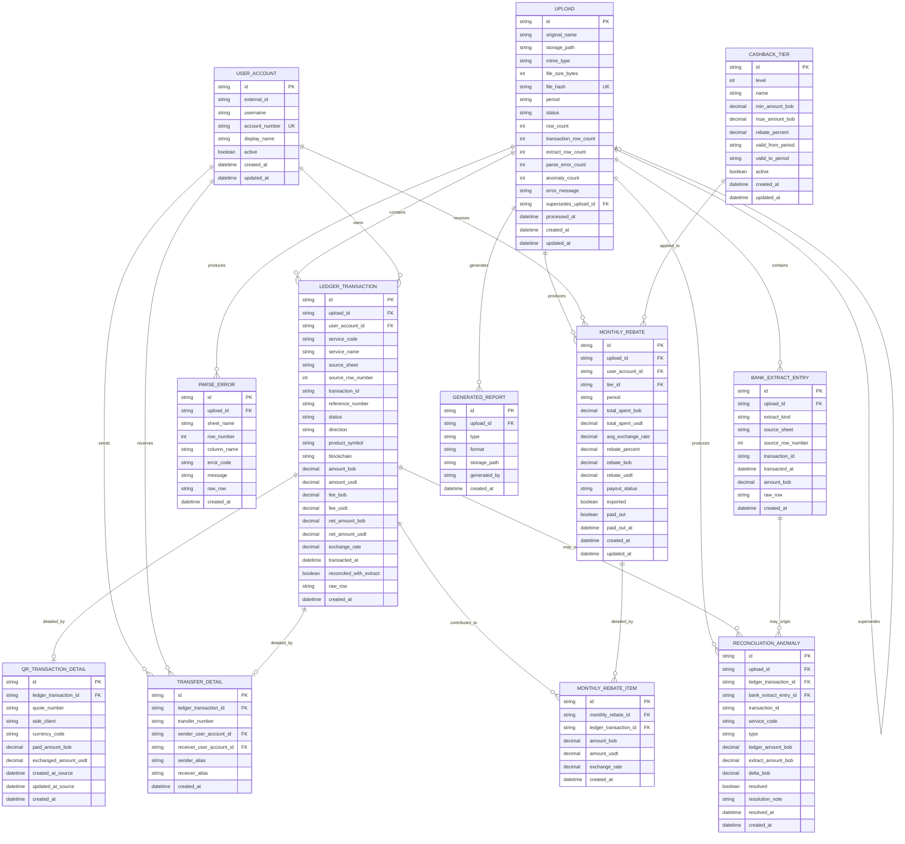

# BanexReintegra - Propuesta de base de datos

Esta propuesta toma como fuente principal `FLOW.md` y sus anexos `design.md` y `agents.md`, pero incorpora una decisión de modelado más robusta para un contexto bancario:

- una entidad canónica de movimientos financieros
- detalles especializados solo cuando la semántica lo exige
- extractos persistidos como evidencia de conciliación
- trazabilidad completa por upload, hoja y fila

La idea es evitar dos extremos frágiles:

- una tabla distinta por cada hoja del Excel
- una tabla genérica gigante llena de columnas nulas

## Criterios de diseño

- El `Upload` sigue siendo la unidad operativa principal.
- Los movimientos de negocio se normalizan en una sola tabla canónica: `LedgerTransaction`.
- Los detalles propios de QR y transferencias viven en tablas complementarias.
- Los extractos se persisten aparte como evidencia auditable de conciliación.
- El reintegro mensual se persiste agregado por cuenta, pero conserva el vínculo con sus movimientos fuente.
- Los tiers se versionan por periodo y no se pisan.
- Las anomalías y errores de parseo quedan auditables por upload.

## Diagrama ER en Mermaid

## Lectura del modelo

### 1. `Upload`

Sigue siendo el centro del proceso. Representa el archivo recibido, su hash, su estado y los conteos finales del procesamiento.

Campos importantes:

- `file_hash` para idempotencia
- `status` para `PENDING | PROCESSING | DONE | FAILED | SUPERSEDED`
- `supersedes_upload_id` para el caso de reemplazo de periodo
- `processed_at` para auditoria operativa

### 2. `UserAccount`

Agrupa al beneficiario desde la optica operativa. El identificador mas confiable sigue siendo `account_number`, mientras `username` o `external_id` pueden cambiar o venir incompletos.

### 3. `LedgerTransaction`

Es la tabla canonica de movimientos financieros del sistema. Aca entran `Pago QR`, `Cobro QR`, `Depositos`, `Retiros` y `Transfers`, todos diferenciados por `service_code`, `source_sheet` y su direccion financiera.

Ventajas:

- evita una tabla por hoja
- conserva una semantica comun para conciliacion y reportes
- soporta nuevos codigos de servicio sin redisenar la base
- mejora la trazabilidad porque cada fila queda ligada a `upload`, hoja y numero de fila

Constraint sugerido:

- unique compuesto en `upload_id + service_code + transaction_id`

### 4. `QrTransactionDetail`

No todos los movimientos necesitan campos QR, pero `Pago QR` y `Cobro QR` si traen semantica propia: `quote_number`, `side_client`, montos de intercambio, moneda y timestamps de origen. Por eso conviene separarlos en una tabla 1:1.

### 5. `TransferDetail`

Las transferencias merecen detalle propio porque involucran dos cuentas internas y no una sola posicion operativa.

Esto permite:

- representar emisor y receptor con precision
- reconstruir mejor BanexTransfer
- evitar meter columnas ambiguas en la tabla canonica

### 6. `BankExtractEntry`

En un contexto bancario es mejor persistir el extracto como evidencia importada, no solo reconstruirlo con queries. Aunque el extracto se parezca a un reporte, si se usa para conciliar conviene guardarlo.

Sirve para:

- auditoria
- reintentos idempotentes
- conciliacion reproducible
- soporte futuro a multiples clases de extracto

### 7. `ParseError`

Responde directo al flujo y a `PersistenceAgent`: guardar filas problematicas sin abortar todo el job.

Util para:

- mostrar errores por hoja y fila
- exportarlos luego en reportes
- mejorar reglas de parsing mas adelante

### 8. `ReconciliationAnomaly`

Representa la salida del `ReconcileAgent`.

Ahora se amarra a:

- `ledger_transaction` como movimiento canonico del sistema
- `bank_extract_entry` como evidencia del extracto

Tipos esperados:

- `NO_EXTRACT`
- `NO_LEDGER`
- `AMOUNT_MISMATCH`
- posible extension futura: `INVALID_RATE`

### 9. `CashbackTier`

Modelo versionado por vigencia mensual.

Idea central:

- no actualizar tiers historicos
- cerrar vigencia con `valid_to_period`
- buscar tiers activos para el periodo procesado

### 10. `MonthlyRebate`

Es el agregado mensual por usuario/cuenta para un upload.

Mantiene doble semantica:

- resultado financiero auditable
- objeto operativo que puede marcarse como exportado o pagado

Constraint sugerido:

- unique compuesto en `upload_id + user_account_id`

### 11. `MonthlyRebateItem`

Esta tabla mantiene el puente entre el agregado mensual y cada movimiento que lo compone. Ahora debe apuntar a `LedgerTransaction`, no a una tabla QR especifica.

Eso habilita:

- drilldown real en auditoria
- reconstruccion exacta del calculo
- reportes explicables sin recalcular

### 12. `GeneratedReport`

Sigue siendo opcional.

Si los reportes se generan on-demand y nunca se almacenan, esta tabla puede desaparecer.
Si queremos trazabilidad de descargas o caching de archivos generados, sirve.

## Constraints recomendados

- `upload.file_hash` unique
- `user_account.account_number` unique
- `ledger_transaction (upload_id, service_code, transaction_id)` unique
- `bank_extract_entry (upload_id, source_sheet, transaction_id)` index
- `monthly_rebate (upload_id, user_account_id)` unique
- indices por `upload_id` en tablas hijas
- indice por `period` en `upload` y `monthly_rebate`
- indice por `service_code` en `ledger_transaction`
- indice por `type, resolved` en `reconciliation_anomaly`

## Tipos y enums sugeridos

### `upload.status`

- `PENDING`
- `PROCESSING`
- `DONE`
- `FAILED`
- `SUPERSEDED`

### `ledger_transaction.direction`

- `DEBIT`
- `CREDIT`

### `reconciliation_anomaly.type`

- `NO_EXTRACT`
- `NO_LEDGER`
- `AMOUNT_MISMATCH`
- `INVALID_RATE`

### `monthly_rebate.payout_status`

- `PENDING`
- `EXPORTED`
- `PAID`
- `BLOCKED`

## Decisiones abiertas para analizar

1. `Transfers` dentro de la tabla canonica mas `TransferDetail`, o en tabla totalmente propia.
   Mi recomendacion inicial: tabla canonica mas detalle 1:1.

2. Si `BankExtractEntry` debe existir solo para archivos realmente externos.
   Mi recomendacion inicial: si participa en conciliacion, se persiste.

3. Si `service_name` debe persistirse o resolverse desde un catalogo.
   Mi recomendacion inicial: persistirlo como snapshot y mas adelante, si hace falta, agregar un catalogo `ServiceType`.

4. Si conviene introducir una tabla de `ledger_batch` o `statement_batch`.
   Solo la agregaria si luego importamos multiples extractos por periodo o por banco.

## Recomendacion practica

Si seguimos esta direccion, el siguiente paso natural seria:

1. ajustar `schema.prisma`
2. crear una nueva migracion sobre la `init`, no editar la `init`
3. adaptar parser, conciliacion y reportes para leer de `LedgerTransaction` y `BankExtractEntry`
